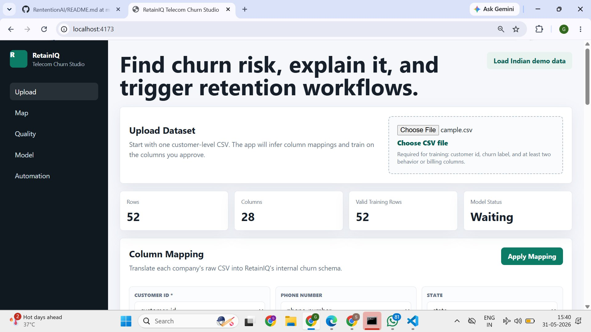
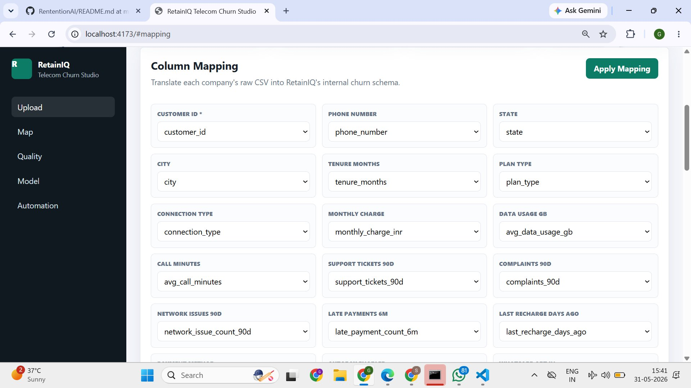
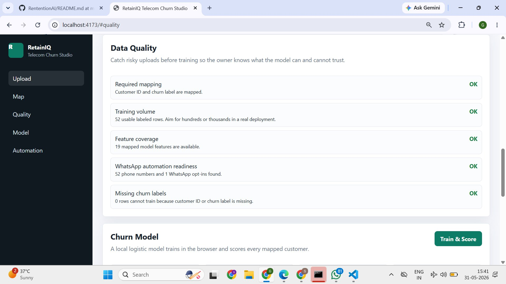
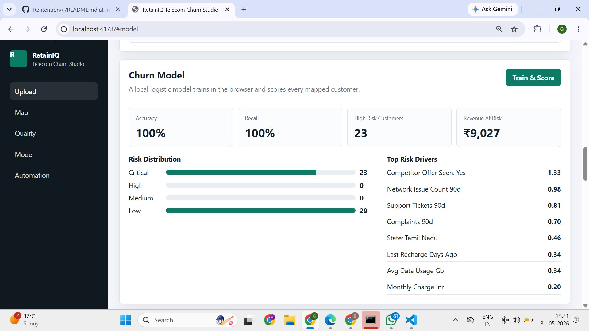
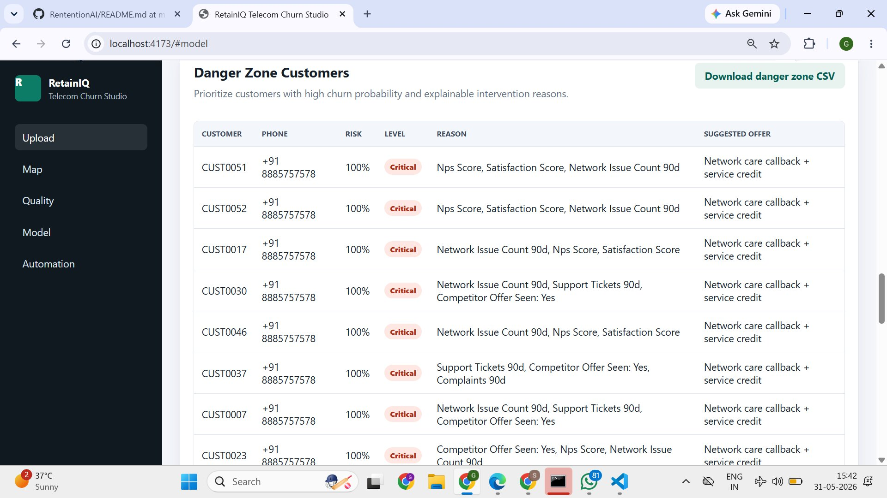
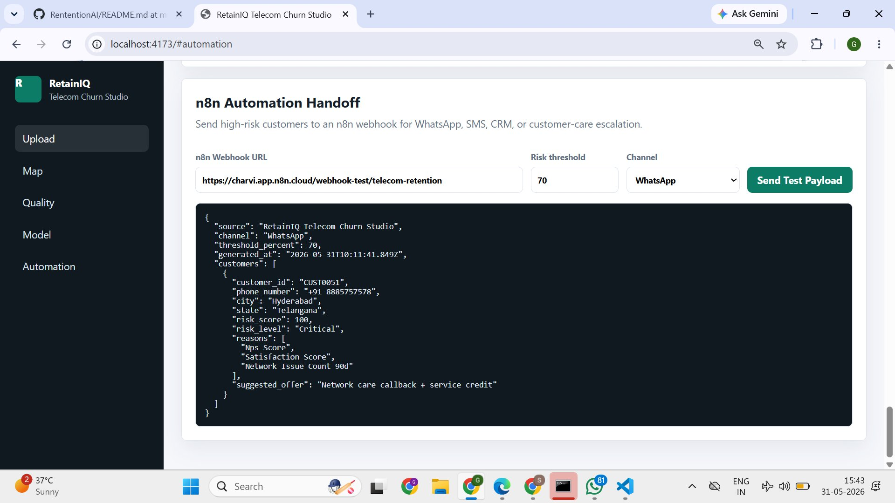
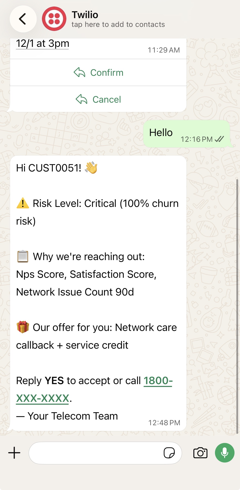

# RetainIQ — Telecom Churn Prediction Studio

A full-stack web application that predicts which telecom customers are at risk of churning, explains the reasons behind each prediction, and fires retention workflows automatically through n8n. No external ML libraries. No black boxes.

---

## What it does

RetainIQ takes a raw customer CSV from any telecom operator, trains a logistic regression model on it in the browser or on a local Python server, scores every customer by churn risk, and hands off the high-risk list to an n8n automation pipeline — which can send WhatsApp messages, SMS, emails, or escalate to a customer-care agent, all within seconds of training.

The application is built around the idea that a retention team should be able to go from raw data to live outreach without touching a single line of code themselves.

---

## Screenshots

### Upload and Column Mapping

Upload any customer-level CSV. The app auto-detects column names and maps them to RetainIQ's internal schema. You review and approve before anything runs.





### Data Quality Check

Before training, the app validates your data — checking for required fields, training volume, feature coverage, WhatsApp opt-in readiness, and missing churn labels. Every check is visible so you know exactly what the model can and cannot trust.



### Model Training and Scoring

The logistic regression model trains in seconds. You see accuracy, recall, high-risk customer count, and estimated revenue at risk. Risk drivers are ranked by weight so you understand what is causing churn in your dataset — not just who is at risk.



### Danger Zone Table

Every high-risk customer is listed with their churn probability, risk level, the top three reasons driving their score, and a suggested retention offer. The list is downloadable as a CSV for CRM import.



### n8n Automation Handoff

The Automation tab generates a structured webhook payload and sends it directly to an n8n workflow. You configure the webhook URL, risk threshold, and channel. The payload carries customer ID, phone number, risk score, churn reasons, and the suggested offer.



### WhatsApp Message Delivery

The n8n workflow receives the payload and sends a personalised WhatsApp message via Twilio — addressed to the customer by ID, explaining why the team is reaching out, and presenting the retention offer with a clear call to action.



---

## Tech stack

| Layer | Details |
|---|---|
| Backend | Python 3, standard library only — no pip install required |
| Machine learning | Logistic regression built from scratch — z-score normalisation, one-hot encoding, batch gradient descent, L2 regularisation |
| Frontend | Vanilla HTML, CSS, JavaScript |
| Static server | Node.js (optional, `server.js`) |
| Automation | n8n webhook + Twilio WhatsApp |

---

## How the model works

The model is implemented from scratch in both Python and JavaScript so results stay consistent whether the backend is running or not.

- Numeric features are z-score normalised (mean 0, std 1)
- Categorical features are one-hot encoded with the top 6 categories per column
- Training runs for 850 epochs with batch gradient descent
- L2 regularisation prevents overfitting on small datasets
- Feature weights are surfaced directly as churn reason explanations — no separate explainability layer needed

The same algorithm runs in the Python backend via `/api/train` and as a browser fallback in `app.js`.

---

## Setup

### With Python backend (recommended)

```bash
cd RententionAI
python backend.py
```

Open `http://localhost:4173`

To use a custom port:

```bash
PORT=8080 python backend.py
```

### With Node.js (frontend only)

```bash
cd RententionAI
node server.js
```

When the Python backend is not running, the app trains the model entirely in the browser using the JavaScript port of the same logistic regression logic.

---

## Project structure

```
backend.py          Python HTTP server + ML training API (/api/train)
app.js              Frontend: CSV parsing, encoding, fallback model, rendering
index.html          App layout
styles.css          Styles
server.js           Static file server (Node.js, no ML API)
data/               Sample Indian telecom CSV — 500 synthetic customers
templates/          Upload format templates (basic and advanced)
docs/               Schema reference and n8n workflow notes
```

---

## Sample dataset

`data/indian_telecom_churn_sample.csv` contains 500 synthetic Indian telecom customers with realistic distributions across prepaid and postpaid plans, states, usage patterns, support history, and churn labels. It is safe to share publicly and is included to let you run the full demo without your own data.

---

## n8n workflow

The `docs/` folder contains the n8n workflow JSON. Import it directly into your n8n instance, connect your Twilio credentials, and point the RetainIQ webhook URL at the webhook trigger node. The workflow handles payload parsing, message formatting, and WhatsApp delivery out of the box.

---

## Automation flow

```
RetainIQ scores customers
        |
        v
Webhook payload sent to n8n
        |
        v
n8n parses risk score and channel
        |
        v
Twilio sends WhatsApp / SMS to customer
        |
        v
Customer receives personalised retention message
```

---

## Key risk drivers identified

From the included sample dataset, the top factors driving churn were:

- Competitor offer seen
- Network issue count (90 days)
- Support ticket volume (90 days)
- Complaint count (90 days)
- Last recharge recency
- Average data usage
- Monthly charge

---

## About

Built as a demonstration that a complete churn prediction and retention automation pipeline can be assembled using standard libraries and open tooling, without depending on any paid ML platform or external data science infrastructure.
